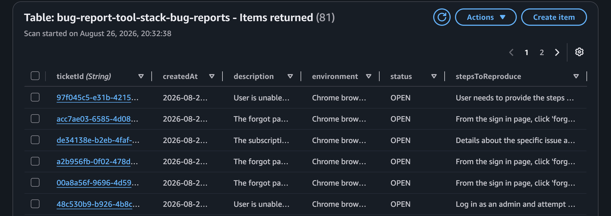
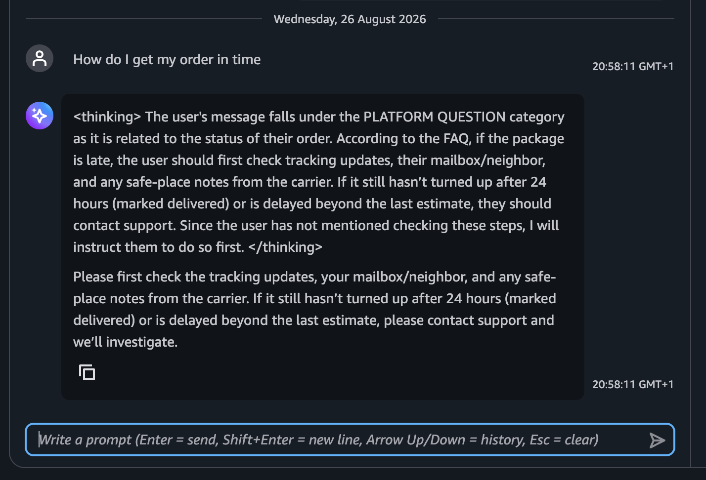
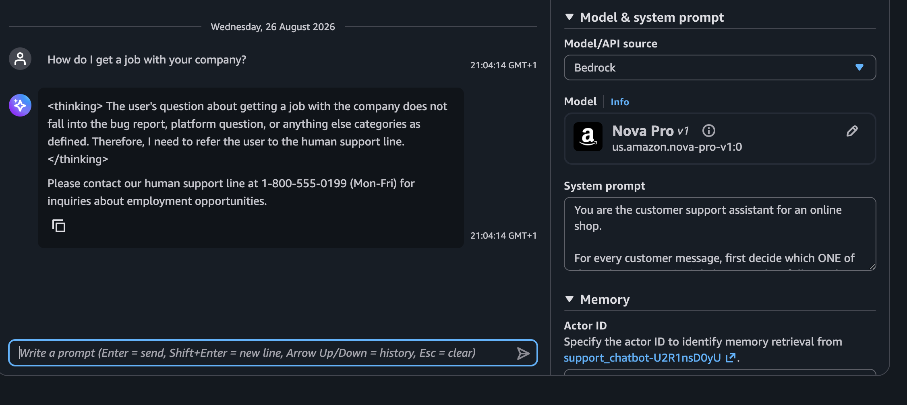
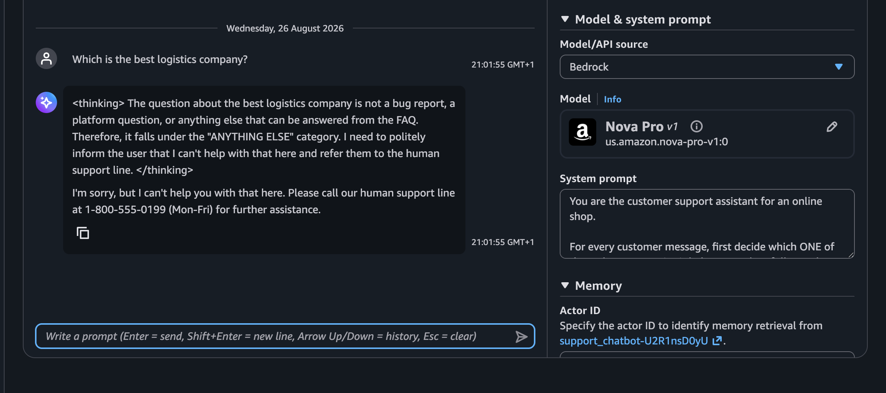
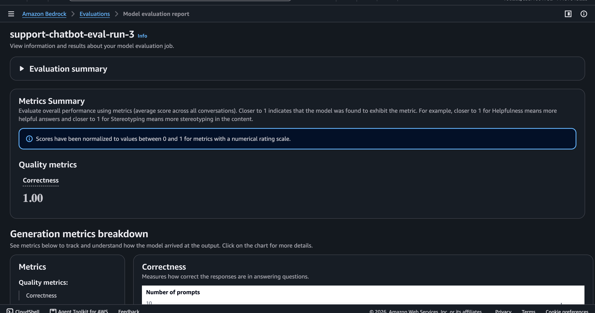

# Project Rubric

## Bug Report Path
- System prompt showing bug report path and its rules - provided in system_promp.txt
- A chat.py transcript of a bug report showing the follow-up questions and the [tool call] bugreports___create_bug_report line - provided in bug_report_transcript.txt
- A screenshot of the bug-report-tool-stack-bug-reports DynamoDB 

## Platform Question and Other Request Paths
- Screenshot of the FAQ Prompt node template showing embedded FAQ content - Not using Bedrock flows for the project
- Screenshots of flow test responses - the screenshots were taken from AgentCore Harness  Test ground instead

## Testing and Evaluation
- JSONL output file - Provided in "output_eval_dataset.jsonl"
- Screenshot of Evaluation page - 
- Recording of Evaluation page to show full details - https://github.com/user-attachments/assets/b8b1bb32-7d21-47ff-8ef9-9781fa5e73f0

## Observation
- The agent kept some context I didn't intend for it to keep - In one of the questions I asked, about my subscription page, it referred to the forgot password issue I asked earlier
- Even when I specifically and explicitly said "Do Not Fabricate the fields", I still saw the model filling up the blanks for some fields that were not provided in the question
